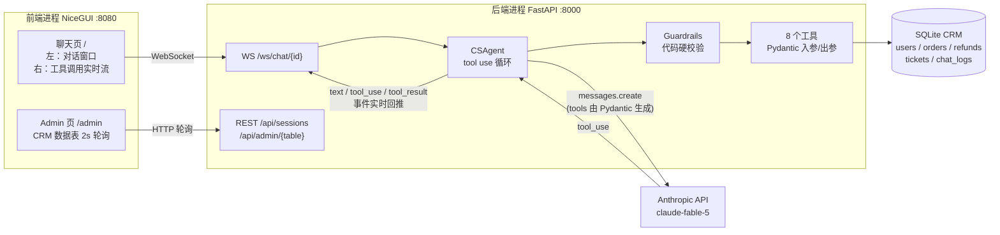

# AI 客服 Agent + CRM Demo

一个能真正"办事"的电商客服 agent：通过 Anthropic 原生 tool use 循环操作 CRM 数据库——查订单、查物流、改地址、退款、转人工，全程带业务护栏（prompt 约束 + 代码硬校验双保险）。

全 Python 技术栈：FastAPI 后端 + NiceGUI 前端（前后端分离）+ SQLite/SQLAlchemy 2.0 + Pydantic v2 + Anthropic SDK（不用 LangChain）。

## 架构



每条消息、每次工具调用与结果都落库 `chat_logs`，admin 页可见。

## 快速开始

```bash
cd ai-cs-agent
cp .env.example .env          # 填入 ANTHROPIC_API_KEY
uv sync                       # 安装依赖
uv run python -m backend.seed # 造数：15 用户 / 50 订单 / 退款单 / 工单
```

两条命令分别启动后端和前端（两个终端）：

```bash
# 终端 1：后端
uv run uvicorn backend.main:app --port 8000

# 终端 2：前端
uv run python frontend/app.py
```

打开 http://127.0.0.1:8080 聊天，http://127.0.0.1:8080/admin 看数据实时变化。

> 模型默认 `claude-fable-5`（要求组织开启 30 天数据保留）。受限时在 `.env` 里改 `ANTHROPIC_MODEL=claude-opus-4-8`。

也可以不起前后端，直接命令行测试：

```bash
uv run python -m backend.cli               # 交互模式
uv run python -m backend.cli --scenario 1  # 预设场景
```

## 三个演示场景

演示用户：手机号 `13800000001` ~ `13800000015`（见 seed 数据，admin 页 users 表可查）。

### 场景 1：查物流（只读链路 + 核身门禁）

| 你说 | 预期 |
|---|---|
| 我想查一下我的快递到哪了 | 客服要求提供注册手机号（未核身时直接查会被护栏拦截） |
| 13800000001 | 调 `verify_identity` 核身成功 |
| 查最近那个运输中的订单 | 依次调 `list_orders` → `get_logistics`，返回轨迹时间线 |

右侧面板看点：工具逐条流式出现，先核身后查询的顺序。

### 场景 2：小额退款成功（写操作 + 二次确认）

| 你说 | 预期 |
|---|---|
| 我买的东西想退款，质量太差了 | 要求核身 |
| 13800000002 | 核身成功 |
| 退那个已签收的、金额 200 以内的订单，全额退 | 客服**复述订单号、金额、原因**，等你确认，不直接执行 |
| 对，确认退款 | 调 `create_refund`，返回退款单号 |

验证数据真的被改了：admin 页 `refunds` 表多了一条 pending 记录，`orders` 表该订单状态变为 `refunded`。

### 场景 3：大额退款触发护栏转人工

| 你说 | 预期 |
|---|---|
| 我要退货！这个东西完全是骗人的 | 要求核身 |
| 13800000014 | 核身成功 |
| 退已签收里最贵的那单，全额退款 | 复述确认 |
| 确认，就退这个 | `create_refund` 被**代码硬护栏**拦截（>¥200），自动创建高优先级工单并返回工单号，agent 结束接待 |

看点：即使模型"想"执行退款，代码层也不会执行——工单是 `create_refund` 内部直接创建的，不依赖模型自觉调用 `escalate_to_human`。admin 页 `tickets` 表可见新工单，`refunds` 表没有新增。

## 8 个工具

| 工具 | 说明 | 护栏 |
|---|---|---|
| `verify_identity(phone)` | 手机号核身，返回 user_id | — |
| `get_user_profile(user_id)` | 查用户资料 | 需核身；仅限本人 |
| `list_orders(user_id, status?)` | 订单列表，可按状态筛选 | 需核身；仅限本人 |
| `get_order_detail(order_no)` | 订单详情 | 需核身；仅限本人订单 |
| `get_logistics(order_no)` | 物流轨迹 | 需核身；仅限本人订单 |
| `update_shipping_address(order_no, new_address)` | 改收货地址 | 仅限待发货；写操作需用户确认 |
| `create_refund(order_no, reason, amount)` | 创建退款单 | >¥200 不执行、自动转人工；写操作需用户确认 |
| `escalate_to_human(summary, priority)` | 建工单并结束接待 | 未核身也可用 |

每个工具的入参/出参都是 Pydantic v2 模型，JSON Schema 由 `model_json_schema()` 自动生成（见 `backend/tools.py`），入参校验失败的错误信息会回传给模型让它修正重试。

## 业务护栏（双保险）

| 规则 | prompt 软约束 | 代码硬校验 |
|---|---|---|
| 未核身禁止查询 | ✅ | ✅ `guardrails.require_verified` |
| 禁止跨用户访问 | ✅ | ✅ `require_own_user` / `require_own_order` |
| 已发货禁改地址 | ✅（解释 + 替代方案） | ✅ `check_address_change_allowed` |
| 退款 >¥200 转人工 | ✅ | ✅ 代码直接建工单，不执行退款 |
| 投诉/法律字眼升级 | ✅（prompt 判断语义） | —（语义判断只能靠模型） |
| 写操作二次确认 | ✅ | —（对话层行为） |

## 目录结构

```
ai-cs-agent/
├── backend/
│   ├── models.py      # SQLAlchemy 2.0 数据模型（5 张表）
│   ├── seed.py        # 造数脚本
│   ├── schemas.py     # 8 个工具的 Pydantic 入参/出参模型
│   ├── tools.py       # 工具注册表 + 实现（Schema 自动生成）
│   ├── guardrails.py  # 代码硬护栏
│   ├── agent.py       # tool use 循环（约 40 行核心逻辑）
│   ├── cli.py         # 命令行测试
│   └── main.py        # FastAPI：REST + WebSocket
└── frontend/
    └── app.py         # NiceGUI：聊天页 + admin 数据面板
```
