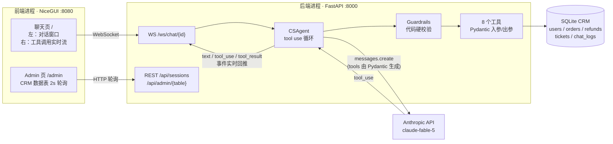

# AI 客服 Agent + CRM Demo

> 一个能真正"办事"的电商客服 Agent：用 Anthropic 原生 tool use 循环直接操作 CRM 数据库——查订单、查物流、改地址、退款、转人工，全程带业务护栏（prompt 软约束 + 代码硬校验，双保险）。

**不用任何 Agent 框架**（不用 LangChain / LlamaIndex），核心循环只有约 40 行，借此把"工具调用智能体"是怎么跑起来的讲清楚；同时用一套分层后端演示了把 LLM Agent 落到真实业务系统里该有的工程结构。

## 亮点

- **真·办事，不只是聊天**：工具直接读写 SQLite CRM，admin 面板能实时看到数据被改。
- **手写 tool use 循环**：`messages.create` → `tool_use` → 执行 → 回填 `tool_result` → 继续，全过程透明可读。
- **双保险护栏**：prompt 约束模型"别做"，代码层在工具执行前强制拦截"做不了"——大额退款即使模型想退也退不掉。
- **Pydantic 即契约**：工具的 JSON Schema 由入参模型 `model_json_schema()` 自动生成，入参校验失败的报错原样回传给模型自我修正。
- **过程可视化**：前端右侧实时流式展示每一次工具调用的入参与返回，演示效果直观。
- **清晰的分层架构**：`api → agent → tools → services → repositories → domain`，依赖单向向下，便于阅读和扩展。

## 技术栈

全 Python，前后端分离：

| 层 | 选型 |
|---|---|
| LLM | Anthropic SDK（`claude-fable-5`，可切 `claude-opus-4-8`） |
| 后端 | FastAPI + Uvicorn（REST + WebSocket） |
| 前端 | NiceGUI（独立进程，纯 HTTP/WS 调后端） |
| 数据 | SQLite + SQLAlchemy 2.0（`Mapped` / `mapped_column`） |
| 校验 | Pydantic v2 |

## 架构



每条消息、每次工具调用与结果都落库 `chat_logs`，admin 页可查，方便审计与复盘。

## 快速开始

### 前置要求

- Python ≥ 3.11
- [uv](https://docs.astral.sh/uv/)（包管理与运行）
- 一个 Anthropic API Key

### 安装与造数

```bash
cd ai-cs-agent
cp .env.example .env               # 填入 ANTHROPIC_API_KEY
uv sync                            # 安装依赖
uv run python -m backend.app.seed  # 造数：15 用户 / 50 订单 / 退款单 / 工单
```

### 启动（两个终端）

```bash
# 终端 1：后端
uv run uvicorn backend.app.api.main:app --port 8000

# 终端 2：前端
uv run python frontend/app.py
```

打开 <http://127.0.0.1:8080> 聊天，<http://127.0.0.1:8080/admin> 看数据实时变化。

### 不起前端，直接命令行测试

```bash
uv run python -m backend.app.cli               # 交互模式
uv run python -m backend.app.cli --scenario 1  # 跑预设演示场景（1/2/3）
```

## 配置

所有配置走 `.env`（见 `.env.example`），由 `backend/app/core/config.py` 统一读取：

| 变量 | 默认值 | 说明 |
|---|---|---|
| `ANTHROPIC_API_KEY` | —（必填） | Anthropic API Key |
| `ANTHROPIC_MODEL` | `claude-fable-5` | 模型 ID |
| `DATABASE_URL` | `sqlite:///./crm.db` | 数据库连接串 |
| `BACKEND_URL` | `http://127.0.0.1:8000` | 前端访问后端的地址 |
| `MAX_TOOL_ROUNDS` | `10` | 单轮用户消息允许的最大工具调用轮数（防失控） |
| `REFUND_AUTO_ESCALATE_THRESHOLD` | `200` | 超过此金额（元）的退款不自助执行，自动转人工 |

> 默认模型 `claude-fable-5` 要求组织开启 30 天数据保留；若你的组织是零保留（ZDR）配置，请改用 `ANTHROPIC_MODEL=claude-opus-4-8`。

## 三个演示场景

演示用户：手机号 `13800000001` ~ `13800000015`（见 seed 数据，admin 页 users 表可查）。

### 场景 1 · 查物流（只读链路 + 核身门禁）

| 你说 | 预期 |
|---|---|
| 我想查一下我的快递到哪了 | 客服要求提供注册手机号（未核身直接查会被护栏拦截） |
| 13800000001 | 调 `verify_identity` 核身成功 |
| 查最近那个运输中的订单 | 依次调 `list_orders` → `get_logistics`，返回轨迹时间线 |

看点：右侧面板里工具逐条流式出现，能看到"先核身后查询"的顺序。

### 场景 2 · 小额退款成功（写操作 + 二次确认）

| 你说 | 预期 |
|---|---|
| 我买的东西想退款，质量太差了 | 要求核身 |
| 13800000002 | 核身成功 |
| 退那个已签收的、金额 200 以内的订单，全额退 | 客服**复述订单号、金额、原因**，等你确认，不直接执行 |
| 对，确认退款 | 调 `create_refund`，返回退款单号 |

验证数据真被改了：admin 页 `refunds` 表多一条 pending 记录，`orders` 表该订单状态变为 `refunded`。

### 场景 3 · 大额退款触发护栏转人工

| 你说 | 预期 |
|---|---|
| 我要退货！这个东西完全是骗人的 | 要求核身 |
| 13800000014 | 核身成功 |
| 退已签收里最贵的那单，全额退款 | 复述确认 |
| 确认，就退这个 | `create_refund` 被**代码硬护栏**拦截（>¥200），自动建高优先级工单并返回工单号，agent 结束接待 |

看点：即使模型"想"执行退款，代码层也不会执行——工单是 `create_refund` 内部直接创建的，**不依赖模型自觉调用** `escalate_to_human`。admin 页 `tickets` 表可见新工单，`refunds` 表没有新增。

## tool use 循环：一条消息是怎么跑起来的

核心逻辑在 `backend/app/agent/agent.py`（`CSAgent.run`）：

1. 前端 `POST /api/sessions` → 后端创建一个 `CSAgent` 实例存入内存，返回 `session_id`。
2. 前端通过 `WS /ws/chat/{session_id}` 发送 `{"message": "..."}`。
3. 后端把同步的 `agent.run` 丢进线程池，工具事件经回调实时推回 WebSocket。
4. `run` 进入循环（上限 `MAX_TOOL_ROUNDS`）：
   - 带 `tools` 调 `messages.create`；
   - `stop_reason == "tool_use"` → 逐个执行工具，把 `tool_result` 合并成一条 user 消息回填，**继续循环**让模型据此决定下一步；
   - 其它 `stop_reason` → 收尾返回最终文本；
   - `stop_reason == "refusal"`（Fable 安全分类器拒答）→ 返回兜底文案。
5. 工具执行器 `execute_tool`（`tools/registry.py`）是一道"漏斗"：Pydantic 校验入参 → 调 handler → 出参 `model_dump_json`。失败分三类原样回传给模型（未知工具 / 入参校验失败 / 护栏拦截 `GuardrailViolation`），模型据此向用户解释或自我修正重试。

## 8 个工具

| 工具 | 说明 | 护栏 |
|---|---|---|
| `verify_identity(phone)` | 手机号核身，返回 user_id | — |
| `get_user_profile(user_id)` | 查用户资料 | 需核身；仅限本人 |
| `list_orders(user_id, status?)` | 订单列表，可按状态筛选 | 需核身；仅限本人 |
| `get_order_detail(order_no)` | 订单详情 | 需核身；仅限本人订单 |
| `get_logistics(order_no)` | 物流轨迹 | 需核身；仅限本人订单 |
| `update_shipping_address(order_no, new_address)` | 改收货地址 | 仅限待发货；写操作需用户确认 |
| `create_refund(order_no, reason, amount)` | 创建退款单 | >¥200 不执行、自动转人工；写操作需用户确认 |
| `escalate_to_human(summary, priority)` | 建工单并结束接待 | 未核身也可用 |

每个工具的入参/出参都是 Pydantic v2 模型，JSON Schema 由 `model_json_schema()` 自动生成（注册逻辑见 `backend/app/tools/registry.py`，入参/出参模型见 `backend/app/domain/schemas/`）。

## 业务护栏（双保险）

| 规则 | prompt 软约束 | 代码硬校验 |
|---|---|---|
| 未核身禁止查询 | ✅ | ✅ `require_verified` |
| 禁止跨用户访问 | ✅ | ✅ `require_own_user` / `require_own_order` |
| 已发货禁改地址 | ✅（解释 + 替代方案） | ✅ `check_address_change_allowed` |
| 退款 >¥200 转人工 | ✅ | ✅ 代码直接建工单，不执行退款 |
| 投诉/法律字眼升级 | ✅（prompt 判断语义） | —（语义判断只能靠模型） |
| 写操作二次确认 | ✅ | —（对话层行为） |

代码硬护栏集中在 `backend/app/services/guardrails.py`，在工具执行前强制生效，模型绕不过去。

## 目录结构

分层架构，依赖单向向下：`api → agent → tools → services → repositories → domain`。

```
ai-cs-agent/
├── backend/
│   └── app/
│       ├── core/config.py        # 配置（.env / 环境变量，含护栏阈值）
│       ├── db/session.py         # SQLAlchemy engine + session
│       ├── domain/
│       │   ├── enums.py          # 业务枚举（会员/订单/退款/工单）
│       │   ├── models.py         # SQLAlchemy 2.0 数据模型（5 张表）
│       │   └── schemas/          # 8 个工具的 Pydantic 入参/出参模型（按域拆分）
│       ├── repositories/         # 纯数据访问（users/orders/refunds/tickets/chat_logs）
│       ├── services/             # 业务逻辑（identity/order/refund/ticket）+ guardrails 硬护栏
│       ├── tools/                # 工具注册表 + 8 个工具（Schema 自动生成）
│       ├── agent/                # tool use 循环（agent.py）+ system prompt（prompt.py）
│       ├── api/                  # FastAPI：main(入口) + chat(WS) + admin(REST)
│       ├── seed.py               # 造数脚本
│       └── cli.py                # 命令行测试
└── frontend/
    └── app.py                    # NiceGUI：聊天页 + admin 数据面板（独立进程，走 HTTP/WS）
```

各层职责：

- **domain**：枚举、ORM 模型、工具 I/O schema，无业务逻辑。
- **repositories**：纯数据访问，输入 `Session` 返回 ORM 对象，不含规则判断。
- **services**：业务逻辑与硬护栏，是规则的唯一来源。
- **tools**：把 service 包装成 Anthropic 工具，负责会话级 `Session` 生命周期。
- **agent**：tool use 循环与 system prompt。
- **api**：FastAPI 入口与路由（会话/WebSocket/admin）。

## 设计取舍与 Demo 限制

这是一个聚焦"讲清楚 Agent 怎么落地业务"的 Demo，刻意保持简单，**未做生产化**：

- **会话在内存**：`CSAgent` 实例存进程内存（`api/chat.py` 的 `AGENTS` dict），后端重启即丢失会话历史（`chat_logs` 仍落库）。
- **无鉴权**：核身只是业务流程示意，admin 接口与 WebSocket 都没有身份认证，仅供本地演示。
- **SQLite 单文件**：默认 `crm.db`；WebSocket 多线程访问已开 `check_same_thread=False`，但并发能力有限。
- **单号按行数生成**：退款/工单号用"计数 + 1"生成（`services/numbers.py`），非并发安全、跨月可能重号，仅够演示。
- **同步 SDK + 线程池**：用同步 Anthropic 客户端，靠 `asyncio.to_thread` 不阻塞事件循环；非全异步实现。

生产化方向（留作扩展）：会话/状态外置（Redis/DB）、接入鉴权、单号用数据库序列或雪花 ID、换 PostgreSQL、流式输出 token 级、为工具与护栏补单测。
